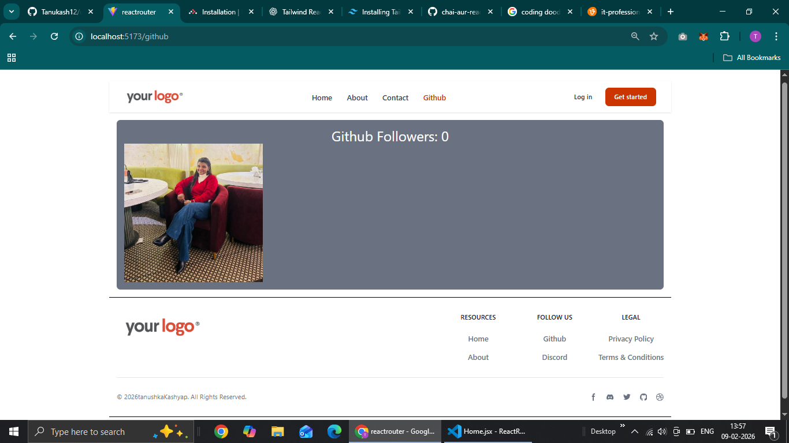

# ⚛️ React Router Project (Advanced Routing + API)

A React project demonstrating modern routing using **React Router DOM**, dynamic routes, loaders, and API integration.
This project focuses on building structured layouts, handling dynamic URLs, and fetching live data from external APIs.

---
## 📸 Project Preview


---

## 🚀 Features

### 🧩 1. Layout with Outlet (Automatic Rendering)

* Implemented a shared layout using `Outlet`
* Provides automatic rendering of child routes
* Layout defined at root path `/`
* Managed via `react-router-dom` in `main.jsx`

---

### 🛣️ 2. Router Setup using RouterProvider

Router created using `createBrowserRouter` in two different ways:

#### Method 1: Array of route objects

* Direct route configuration using array structure

#### Method 2: createRoutesFromElements

* JSX-based routing
* More readable and structured
* Nested routes support

---

### 🔗 3. Dynamic Routing using useParams()

* Implemented dynamic routes using `:id`
* Accessed dynamic values via `useParams()` hook
* Example:

```
/user/:id
```

* Allows rendering data based on URL parameters

---

### 🌐 4. API Integration (GitHub Followers)

* Fetched live GitHub user data
* Used `async/await` with `fetch`
* Implemented loader function in React Router
* Data displayed using `useLoaderData()` hook
* Shows followers and profile image dynamically

---

## 🛠️ Tech Stack

* React JS (Vite)
* React Router DOM
* Tailwind CSS
* JavaScript (ES6+)
* GitHub REST API

---

## 📂 Project Setup

### Install dependencies

```bash
npm install
```

### Run project

```bash
npm run dev
```

---

## 🧠 Learning Outcomes

* Nested routing in React
* Layout handling with Outlet
* Dynamic routing using params
* API fetching using loader functions
* Modern React Router architecture
* Clean component-based structure

---

## 👩‍💻 Author

**Tanushka Kashyap**

